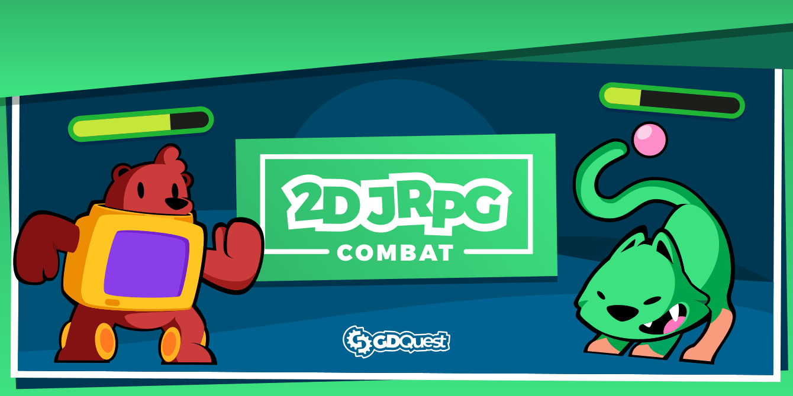
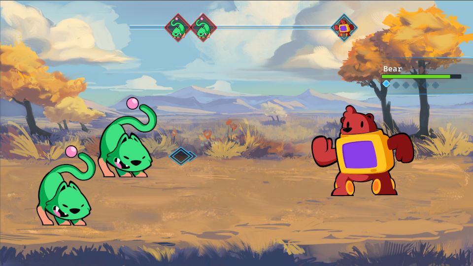

# Godot 2D JRPG Combat System

This demo is an Active Time Battle system for Godot designed for the course [Godot 2D Secrets](https://gdquest.mavenseed.com/courses/godot-2d-secrets).

➡ Follow us on [Twitter](https://twitter.com/NathanGDQuest) and [YouTube](https://www.youtube.com/c/gdquest/) for free game creation tutorials, tips, and news!

## Features

- Active time battle with time that slows down on the player's turn
- Combat menu built from the player's combat actions
- Target selection arrow
- Simple animations
- Animated HUD for each party member
- Turn-based AI
- Stat system with base and final stats that support buffs and debuffs
- Status effects

The demo shows examples of patterns like commands (Action), sandboxing (BattlerAI), signal buses (Events autoload), and tries to give an example of good practices organizing your Godot projects.
